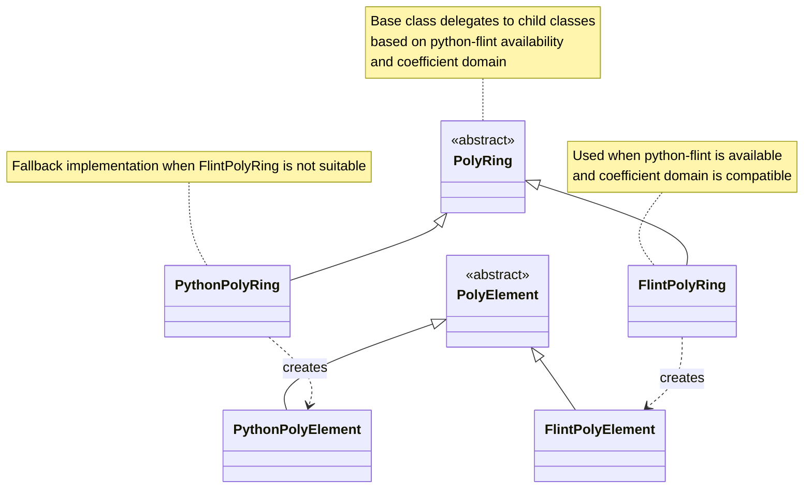

The first week intuitively started with the onset of _phase 1_ i.e. Integration of a `FLINT` based backend into the sparse polynomial rings(`PolyRing`) and element(`PolyElement`) classes in `SymPy`.  

## **What was planned ?**

The rough plan I had in mind was:

1. Clean up the prototypes for `FlintPolyRing` and `FlintPolyElement` I showcased in my [proposal](https://drive.google.com/file/d/1KCJmx-uxM1QvxGpM9gCsw7RvQyW2MPQg/view?usp=sharing).
2. Run existing tests against the methods already implemented.
3. Keep adding more methods in the meantime and test those as well.
4. While doing steps 2 and 3, get the codebase into shape for an initial commit/PR.
5. From there, follow the usual iterative process: **review, refine, commit, repeat**.

Well, things didn't exactly go according to this plan, rather kind of diverted from this to later get back right on this. Read ahead to find out. 

---

## **What did I work on ?**

I worked on steps 1, 2, 3 and 4 extensively before the coding period actually began, I tried refining the prototypes for `FlintPolyRing` and `FlintPolyElement`, readying them for an initial commit, implementing the missing methods and testing them out. 

Once they were refined, what was needed in my opinion was integration, a setup where `SymPy` starts using these `FLINT`-backed versions when sparse polynomials and rings are built over the integer (ℤ) and rational (ℚ) coefficient domains.

Now, sparse polynomials in `SymPy` i.e. `PolyElement` objects are built from the generators(jargon for variables in layman terms, for example $x$ is a generator of the polynomial $x + 1$) of a ring i.e. `PolyRing` object. These `PolyRing` objects are built using the _factory method_ `ring`. This is how it is used:

```python
In [1]: from sympy.polys.rings import ring

In [2]: from sympy.polys.domains import ZZ

In [3]: R, x, y, z  = ring("x,y,z", ZZ) # Building a multivariate sparse polynomial ring

In [4]: R
Out[4]: Polynomial ring in x, y, z over ZZ with lex order

In [5]: type(R)
Out[5]: sympy.polys.rings.PolyRing

In [6]: p = x + y + z # Sparse polynomial built from the generators of R

In [7]: type(p)
Out[7]: sympy.polys.rings.PolyElement
```

And this is how the `ring` method looks like:

```python
@public
def ring(symbols, domain, order: MonomialOrder|str = lex):
    _ring = PolyRing(symbols, domain, order)
    return (_ring,) + _ring.gens
```

So, to integrate my `FLINT` backed prototypes into this, what needed to be done was modifying the `ring` method to check if the user has `python-flint` installed, if yes, then it should check if the coefficient domain over which the user is trying to build the polynomial ring is supported by our prototype of `FlintPolyRing` or not, in this case, it means checking whether the domain is `ZZ`/`QQ`, if yes, then return a `FlintPolyRing` object otherwise fall back to the pure python implementation that returns a `PolyRing` object.

So, this is how it looked like in code:

```python
from sympy.external.gmpy import GROUND_TYPES

if GROUND_TYPES == 'flint':
    import flint
    def _supported_flint_domain(domain):
        return domain == ZZ or domain == QQ
else:
    flint = None
    def _supported_flint_domain(domain):
        return False

@public
def ring(symbols, domain, order: MonomialOrder|str = lex):
    if flint is not None:
        if _supported_flint_domain(domain):
            _ring = FlintPolyRing(symbols, domain, order)
            return (_ring,) + _ring.gens

    _ring = PolyRing(symbols, domain, order)
    return (_ring,) + _ring.gens
```

This is nearly identical to how the `DMP` class decides between returning `DMP_Python` or `DUP_Flint` object in [`sympy/polyclasses.py`](https://github.com/sympy/sympy/blob/master/sympy/polys/polyclasses.py)

---

## **Change in plans**

The above described way of integrating the `FLINT` backend isn't really the best idea, I learned that a better way to do this is instead of changing the factory method `ring`, we can turn the class `PolyRing` into a base class, which parents two new classes, `PythonPolyRing` and `FlintPolyRing`, where the children classes will override the methods and functionalities of the base class. Then, we can employ the same mechanism described above inside the base class `PolyRing` to delegate to its children classes depending on the availability of `python-flint` and the coefficient domain over which the ring is being built. 

Similarly, even `PolyElement` can be a base class to its children `PythonPolyElement` and `FlintPolyElement` each referenced by `PythonPolyRing` and `FlintPolyRing` respectively. 

This can be shown as:



---

## **Execution**

I created the [PR-28110](https://github.com/sympy/sympy/pull/28110) and this does, quite a lot of work all at once, it creates the whole baseclass-subclass hierarchy shown in the diagram above and implements the code in all the 4 subclasses and 2 base-classes without much of a clear separation between what should be completely handled by the base-classes and what main functionalities should be handled by the subclasses. 
It created a massive diff which was very difficult to navigate through for me locally and also impossible to review. 

**_Lesson Learned_**: When dealing with such a huge codebase, don't do everything all at once, prepare the existing the codebase for the upcoming significant refactor to begin with.

Quoting from my mentor, Oscar's comment here:

"I think it is better to start with one PR to refactor things without introducing any new classes but just reorganising the methods in preparation for the new classes."

What this notion amounts to is, we have to separate the interface and implementation specific logic, where all the interface logic like type checking, raising errors and _awkward_ stuff like that goes into the the baseclass and is handled centrally for both python and flint versions of the classes. Whereas the implementation specific logic is overridden by the subclasses. 

For example, `PolyElement` has the `__add__` method to handle addition of two sparse polynomials:

```python
def __add__(p1, p2):
    """Add two polynomials.

    Examples
    ========

    >>> from sympy.polys.domains import ZZ
    >>> from sympy.polys.rings import ring

    >>> _, x, y = ring('x, y', ZZ)
    >>> (x + y)**2 + (x - y)**2
    2*x**2 + 2*y**2

    """
    if not p2:
        return p1.copy()
    ring = p1.ring
    if ring.is_element(p2):
        p = p1.copy()
        get = p.get
        zero = ring.domain.zero
        for k, v in p2.items():
            v = get(k, zero) + v
            if v:
                p[k] = v
            else:
                del p[k]
        return p
    elif isinstance(p2, PolyElement):
        if isinstance(ring.domain, PolynomialRing) and ring.domain.ring == p2.ring:
            pass
        elif isinstance(p2.ring.domain, PolynomialRing) and p2.ring.domain.ring == ring:
            return p2.__radd__(p1)
        else:
            return NotImplemented

    try:
        cp2 = ring.domain_new(p2)
    except CoercionFailed:
        return NotImplemented
    else:
        p = p1.copy()
        if not cp2:
            return p
        zm = ring.zero_monom
        if zm not in p1.keys():
            p[zm] = cp2
        else:
            if p2 == -p[zm]:
                del p[zm]
            else:
                p[zm] += cp2
        return p
```

We see edge cases being handled here, type checking being done, try-catch block and awkward interface logic like that wrapping the implementation logic. So, what we should do here is _split_ the method to separate implementation and interface logic, where the former will be overridden by the subclasses and the latter will remain in the base class to be centrally handled. Then it will look something like:

```python
def __add__(p1, p2):
    """Add two polynomials.

    Examples
    ========

    >>> from sympy.polys.domains import ZZ
    >>> from sympy.polys.rings import ring

    >>> _, x, y = ring('x, y', ZZ)
    >>> (x + y)**2 + (x - y)**2
    2*x**2 + 2*y**2

    """
    if not p2:
        return p1.copy()

    ring = p1.ring

    if isinstance(p2, PolyElement):
        if p2.ring == ring:
            return p1._add(p2)
        elif isinstance(ring.domain, PolynomialRing) and ring.domain.ring == p2.ring:
            return p1._add_ground(p2)
        elif isinstance(p2.ring.domain, PolynomialRing) and p2.ring.domain.ring == ring:
            return p2._add_ground(p1)
        else:
            return NotImplemented

    try:
        cp2 = ring.domain_new(p2)
    except CoercionFailed:
        return NotImplemented
    else:
        return p1._add_ground(cp2)

def _add_ground(p1, cp2):
    p = p1.copy()
    if not cp2:
        return p
    ring = p1.ring
    zm = ring.zero_monom
    v = p1.get(zm, ring.domain.zero) + cp2
    if v:
        p[k] = c
    else:
        del p[k]
    return p

def _add(p1, p2):
    p = p1.copy()
    get = p.get
    zero = p1.ring.domain.zero
    for k, v in p2.items():
        v = get(k, zero) + v
        if v:
            p[k] = v
        else:
            del p[k]
    return p
```

So, I held off on [PR-28110](https://github.com/sympy/sympy/pull/28110) and created another pull request, [PR-28119](https://github.com/sympy/sympy/pull/28119) which works on this refactoring/rearrangement of `PolyRing` and `PolyElement` classes.

We are currently working on this refactoring and rearrangment. This requires handling a massive class `PolyElement` and hence will need to be done carefully making sure we don't break something or slow things down. 

I have opened an issue on the `SymPy` repo, to be the central hub of all the discussion related to this phase 1 where we work on backing the sparse multivariate polynomials and rings with `FLINT`.
Anyone who is interested to follow along can stay updated on the issue [HERE](https://github.com/sympy/sympy/issues/28106).

Until the next blog...
